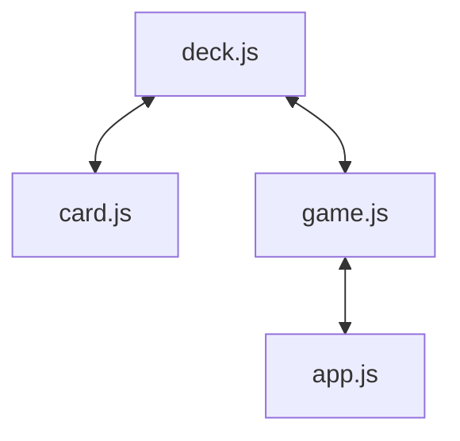

# Binary-Blizzards
CleanCode Version:
- Unused code has been removed
- ADD: Code reorganized to reflect typical game architecture
- Comments added

New Code architecture

```mermaid
flowchart TD
    B[deck.js] <--> A[card.js]
    B <--> C[game.js]
    C <-->D[app.js]
```